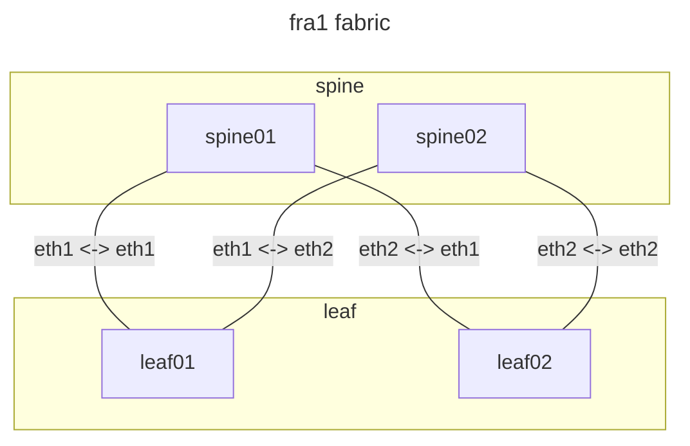
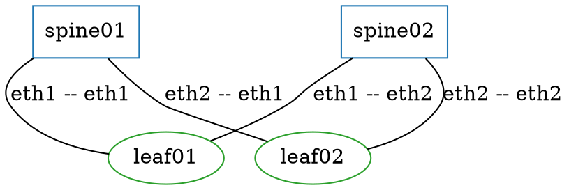

last year, i wrote on my personal blog about what makes an architecture diagram
worth keeping. i wrote that it should be [generated from real data, text-first
so you can diff it, and regenerated whenever the architecture changes](https://blog.veitheller.de/Some_notes_on_architecture_diagrams.html),
because a hand-drawn diagram drifts from reality faster than you can say change
management. i won’t make the argument here again.

instead, this post talks about the other half and dives into the practice. alembic
is a tool for your fabric, but also emits diagrams exactly the same way, from the
same model, because it can.

## a diagram is just another output

alembic holds your fabric as a vendor-neutral model, and it converges that model
onto backends like netbox or containerlab. a diagram doesn’t need anything more.
it’s the same objects, emitted into a different shape. so an emitter is wired up
like any other backend, through the [external-adapter interface](/log/writing-an-external-adapter)
we talked about last month:

```yaml
backend: external
command: alembic-adapter-mermaid
setup:
  out_path: ./out/topology.mmd
  title: fra1 fabric
  group_attr: role
```

point it at the fabric, run the emit, and you get a mermaid graph with nodes
grouped into per-role subgraphs and every link labeled with the interface pair
it connects:



rendered, it might look something like this:


## a second view, same source

no single diagram captures a system, so it helps to emit more than one. the same
fabric through the graphviz dot emitter, which styles nodes per role instead of
grouping them:

```yaml
backend: external
command: alembic-adapter-dot
setup:
  out_path: ./out/topology.dot
  name: fra1
  style_map:
    spine: { shape: box,     color: "#1f77b4" }
    leaf:  { shape: ellipse, color: "#2ca02c" }
```

and again, the output speaks for itself:




two views of one fabric, spines as blue boxes and leaves as green ellipses. it
won’t win on prettiness, but accuracy is a given.

as a bonus, the diagram remains data.

## why?

both outputs are text, so they diff cleanly in a pull request: when we add a leaf,
the diagram gains exactly the lines for that leaf. both are a function of the
model, so they can’t say something the fabric doesn’t. you can generate it as
part of your deployment process and keep your documentation up to date.

in my personal post i argued exactly that this is what i like to see when i
audit or do due diligence. a diagram that is generated, text-first, and
regenerated on change. if i do a security workshop with you, i’ll take that
over a diagram that’s pretty but wrong any day.

mermaid and dot are two shapes we support, but they don’t have to be the ones
you use. the diagram emitters shown here are part of the paid alembic-ops layer,
but in the end they’re just external adapters speaking the open protocol from
[last month’s post](/log/writing-an-external-adapter). a diagram emitter of
your own shape is an afternoon with the free sdk. no private fork required.
